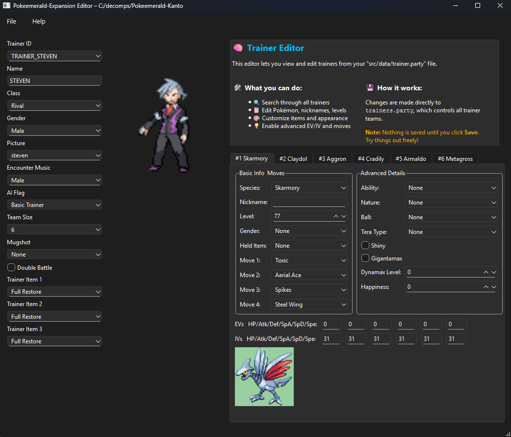

# Expansion Editor
- An editor for pokeemerald-expansion

## About This Tool

This is a PyQt6-based editor designed to streamline your pokeemerald-expansion workflow.  
Manage trainers, create new ones, import sprites, and generate clean event scripts—all in one place.  

Here is a preview of the editor:

### What you get:

- Effortless **trainer editing and creation** with full control over Pokémon stats, moves, abilities, and more.  
- Easy **import of front and overworld sprites** directly into your project folder.  
- A dedicated **Event Script Generator** to quickly create Trainer Battles, Dialogs, and Starter Pokémon scripts.  
- Automatic updating and saving of key project files like `trainers.party` and `opponents.h`.  
- Convenient project management with recent project tracking and intuitive navigation.

### Important Notes:

- The Event Script Generator **creates new event scripts only** — it does **not** load or edit existing map scripts.  
- To compile and use generated scripts, you will need [**Poryscript**](https://github.com/huderlem/poryscript), a higher-level scripting language compiler for pokeemerald and pokeemerald-expansion.  
- For attaching scripts to map objects, [**PoryMap**](https://github.com/huderlem/porymap) is highly recommended—a visual map editor tailored for Gen 3 projects.  
- Currently, imported overworld sprites do **not** have correct palettes applied in-game. Palette handling is a known limitation and may require manual fixes.  
- **More Event Script types will be added in future releases.**

---

## Features

- **Project Folder Integration:** Load your pokeemerald-expansion project and automatically fetch maps, trainers, species, moves, items, and more.  
- **Trainer Maker & Editor:** Create new trainers from scratch or tweak existing ones with ease, including items and AI flags.  
- **Sprite Import:** Drop in `.png` files for trainer fronts and overworld sprites—no manual file juggling required.  
- **Event Script Generator:** Generate copy-paste-ready poryscript snippets with proper script IDs for Trainer Battles, Dialog, and Starter Pokémon events.  
- **Auto-save Prompt:** Never lose work—get prompted to save before quitting if there are unsaved changes.  
- **User-Friendly GUI:** Searchable dropdowns, dynamic Pokémon tabs, and clear status messages help you stay productive.

---

## Usage

1. Start the application.  
2. Open your pokeemerald-expansion project folder via the menu.  
3. Edit or create trainers using the Trainer Maker.  
4. Import trainer sprites as needed.  
5. Generate event scripts using the Event Script Generator tab.  
6. Save all changes before exiting to avoid losing progress.
